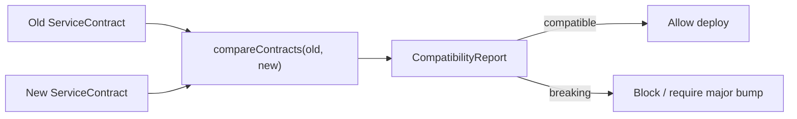

# @aadiaiagent/api-contract-kit

Lightweight **API contract definitions** and **breaking-change detection**. Additive evolution is allowed; removals and type changes fail the gate. Zero runtime dependencies — TypeScript + Vitest + tsx only. Small surface area — readable in one sitting.

## Why contracts gate deploys

Consumer-facing APIs accumulate clients you do not control. A silent field rename or required-field addition can take down partners at merge time. A contract compare step in CI turns that into a deliberate decision: either keep the change and bump a major version, or revert before production.



## Quickstart

```bash
npm install
npm run typecheck
npm test
npm run example
```

```ts
import { compareContracts, type ServiceContract } from "@aadiaiagent/api-contract-kit";

const oldContract: ServiceContract = { /* ... */ };
const newContract: ServiceContract = { /* ... */ };

const report = compareContracts(oldContract, newContract);
if (!report.compatible) {
  console.error(report.changes);
  process.exit(1); // fail the deploy gate
}
```

## Compatibility rules

| Change | Compatible? |
| --- | --- |
| Added endpoint | Yes |
| Added optional field | Yes |
| Removed endpoint | **No** |
| Removed field (required or optional) | **No** |
| Field type change | **No** |
| Newly required field (optional→required or brand-new required) | **No** |

## Design choices

- **Explicit schemas, not reflection.** Contracts are data you own — easy to serialize, diff in PRs, and store next to OpenAPI later.
- **Endpoint identity = `METHOD path`.** Keeps comparison deterministic and readable in CI logs.
- **Field removal always breaks.** Optional fields still appear in client SDKs and docs; deleting them is a consumer-visible event.
- **No runtime validators.** This kit gates *definition* evolution. Pair with Zod/ajv at the edge if you need request validation.
- **Zero runtime deps.** Fits small-surface repos and air-gapped CI.

## Layout

```
src/
  types.ts                 # FieldSchema, EndpointContract, ServiceContract, report types
  compare/compareContracts.ts
  index.ts                 # public exports
tests/compareContracts.test.ts
examples/basic.ts          # fake Orders API v1 → v1.1 vs v2
```

## Roadmap

- [ ] OpenAPI 3.x import → `ServiceContract`
- [ ] JSON Schema field nesting (`object` / `array` item schemas)
- [ ] Semver suggestion from change set (patch / minor / major)
- [ ] CLI: `npx api-contract-kit compare old.json new.json`

## License

MIT © 2026 aadiaiagent-max
